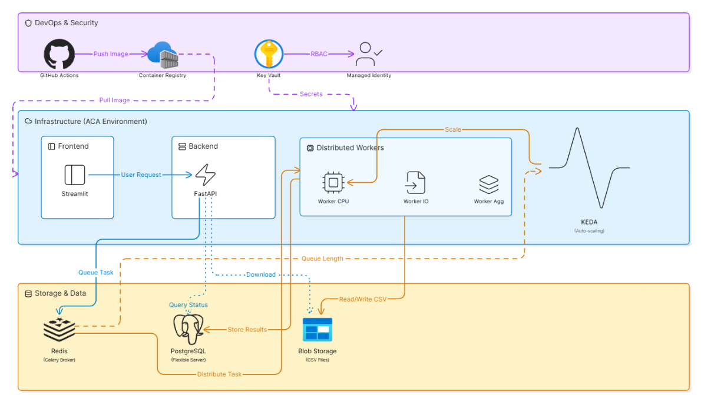
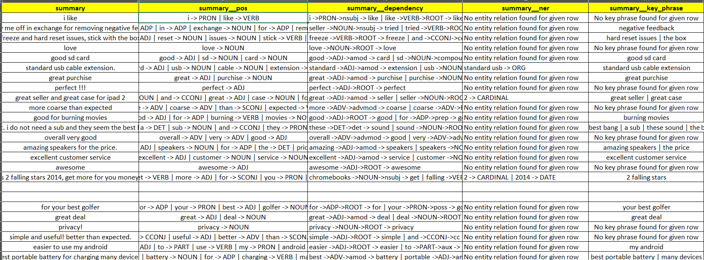
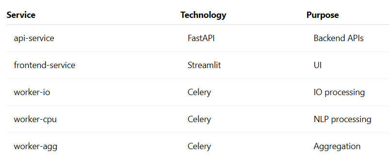

# 1. CloudScale NLP Platform

  A cloud-native, scalable NLP processing platform built using FastAPI, Celery, Redis, PostgreSQL, Azure Container Apps, and Streamlit. The platform supports distributed text normalization and NLP processing workloads using asynchronous microservices architecture.

  The platform generates:
  * POS tagging results
  * Dependency parsing outputs
  * Named entity recognition outputs
  * Semantic keyphrases
  * Processed CSV/Excel exports

# 2. Architecture Overview

  The platform follows a distributed microservices architecture with asynchronous task orchestration.
  
  

# 3. Core Components

  - Frontend Service → Streamlit UI for user interaction
  - API Service → FastAPI backend APIs
  - Worker Services → Celery-based distributed workers
  - Redis → Message broker and task queue
  - PostgreSQL → Persistent metadata and job tracking
  - Azure Blob Storage → File storage
  - Azure Container Apps → Container orchestration
  - Azure Container Registry (ACR) → Docker image registry
  - GitHub Actions → CI/CD automation
  - Azure Key Vault → Secret management

# 4. Application Screenshots

  ### a. Frontend UI

  

  

  ### b. NLP Processing Results
    
  

  

  

  ### c. Azure resources Provisioned

  

  ### d. Output file

  

# 5. NLP Processing Pipeline
   
  The platform performs distributed NLP processing using asynchronous Celery workers and SpaCy-based linguistic analysis.

  ## a. NLP Features Implemented

   ### 1. Part-of-Speech (POS) Tagging 
    Extracts grammatical roles for tokens in text.

    Example:
    customer -> NOUN
    loved -> VERB
    service -> NOUN
    
   ### 2. Dependency Parsing
    Performs syntactic dependency analysis to understand relationships between words.

    Example:
    loved -> VERB -> ROOT
    service -> NOUN -> dobj
   
   ### 3. Named Entity Recognition (NER)
    Identifies entities such as:

    * Organizations
    * Locations
    * Dates
    * People
    * Products

    Example:
    Microsoft -> ORG
    India -> GPE
   
   ### 4. Keyphrase Extraction
    Semantic keyphrase extraction is performed using transformer embeddings and vector similarity scoring.

    Features:

    * Embedding-based phrase ranking
    * Cached phrase embeddings
    * Context-aware phrase extraction

# 6. Tech Stack

  ## a. Backend

    - Python 3.12
    - FastAPI
    - Celery
    - SQLAlchemy
    - Pydantic
    - Redis
    - PostgreSQL
    - Azure SDK

  ## b. Frontend

    - Streamlit

  ## c. Infrastructure & DevOps

    - Docker
    - Docker Compose
    - Azure Container Apps
    - Azure Container Registry (ACR)
    - Azure Key Vault
    - GitHub Actions
    - Azure CLI

  ## d. NLP Technology Stack & Data Processing

    - Pandas
    - NumPy
    - Scikit-learn
    - OpenPyXL
    - PyArrow
    - SpaCy
    - Sentence Transformers

# 7. Project Structure

    cloudscale-nlp-platform/
    │
    ├── api_service/                 # FastAPI backend APIs
    ├── frontend_service/            # Streamlit frontend
    ├── worker_service/              # Celery distributed workers
    ├── data_layer/                  # Database models and repositories
    ├── common/                      # Shared configuration and utilities
    ├── utility/                     # NLP and text normalization utilities
    ├── logger/                      # Logging utilities
    ├── Infrastructure/              # Infrastructure-related configs
    ├── .github/workflows/           # CI/CD pipelines
    ├── docker-compose.yml
    └── pyproject.toml

# 8. Distributed Worker Architecture
  The platform uses dedicated Celery workers for workload isolation.

  ## a. Worker Types

   ### 1. IO Worker
          Handles:
              - File upload/download
              - Blob storage operations
              - Excel/CSV ingestion
              - File chunking

   ### 2. CPU Worker
          Handles:
              - NLP processing
              - Text normalization
              - Column processing
              - Heavy CPU-bound transformations

   ### 3. Aggregation Worker
          Handles:
              - Result aggregation
              - Final output generation
              - ZIP packaging
              - Status updates

# 9. Key Features

  ## a. NLP Processing

    - Text normalization
    - Aspect extraction
    - Chunk processing
    - Distributed NLP execution
    - Asynchronous processing

  ## b. Scalable Architecture

    - Independent microservices
    - Queue-based workload distribution
    - Horizontally scalable workers
    - Containerized deployment

  ## c. Cloud Native Deployment

    - Fully containerized
    - Azure-native infrastructure
    - CI/CD enabled
    - Secret management using Key Vault

  ## d. Monitoring & Logging

    - Structured logging
    - Container logs
    - Celery worker monitoring
    - Azure diagnostics support

# 10. Database Design

    PostgreSQL is used for:

    - Job tracking
    - Processing status
    - Metadata storage
    - Task orchestration state

    SQLAlchemy ORM is used for database abstraction.

# 11. Redis Usage

    Redis is used as:

    - Celery message broker
    - Task queue backend
    - Distributed communication layer

    The platform uses secure Redis connectivity over SSL.

# 12. Azure Services Used

  ## a. Azure Container Apps

    Used for hosting:

    - API Service
    - Frontend Service
    - Worker Services

  ## b. Azure Container Registry (ACR)

    Used for:

    - Docker image storage
    - CI/CD image deployment

  ## c. Azure Database for PostgreSQL Flexible Server

    Used for:

    - Relational database management
    - Persistent job tracking

  ## d. Azure Cache for Redis

    Used for:

    - Distributed task queue
    - Celery broker backend

  ## e. Azure Blob Storage

    Used for:

    - File uploads
    - Intermediate processing storage
    - Final output storage

  ## f. Azure Key Vault

    Used for:

    - Secure secret management
    - Database credentials
    - Redis credentials
    - Storage account secrets

# 13. CI/CD Pipeline

    GitHub Actions is used for automated deployment.

  ## a. Infrastructure Workflow
    infra.yml

    Responsible for:

    - Resource Group creation
    - Redis provisioning
    - PostgreSQL provisioning
    - Container Apps Environment setup
    - ACR setup

  ## b. Deployment Workflow

    deploy.yml

    Responsible for:

    - Docker image build
    - Docker image push to ACR
    - Container App deployment
    - Environment variable injection
    - Service updates

# 14. Security Practices

    - Secrets stored in Azure Key Vault
    - Managed identities used where applicable
    - SSL-enabled Redis connections
    - PostgreSQL SSL connectivity
    - GitHub secret scanning compliance
    - Environment-based configuration

# 15. Environment Variables

    Example environment variables:

    APP_NAME=CloudScale NLP Platform
    DATABASE_URL=<postgres-url>
    REDIS_URL=<redis-url>
    STORAGE_CONNECTION_STRING=<storage-connection>
    STORAGE_ACCOUNT_KEY=<storage-key>

# 16. Local Development

  ## a. Clone Repository
    git clone https://github.com/ChetanFernandes/cloudscale-nlp-platform.git
    cd cloudscale-nlp-platform

  ## b. Run Using Docker Compose
    docker compose up --build

# 17. Deployment Flow

  ## a. Step 1 — Infrastructure Provisioning
      Run GitHub Actions workflow: Provision Azure Infrastructure

      This provisions:

      - Resource Group
      - ACR
      - Redis
      - PostgreSQL
      - Container Apps Environment

  ## b. Step 2 — Application Deployment
      Run: Deploy Application
      This deploys:
        - API Service
        - Frontend Service
        - Worker Services

# 18. Containerized Services
  

# 19. Scalability Considerations

    - Independent worker scaling
    - Queue-based architecture
    - Stateless containers
    - Cloud-native deployment model
    - Distributed asynchronous execution
    - Auto-scaling policies for Celery workers based on queue length
    - Horizontal scaling support using Azure Container Apps and KEDA

# 20. Auto Scaling Strategy

    The worker-cpu service is configured with auto-scaling policies using Azure Container Apps and KEDA.

    Scaling decisions are based on:
        - Celery queue length
        - NLP processing workload
        - Concurrent task volume

    When queue length increases, additional worker replicas are automatically provisioned to handle distributed NLP processing efficiently.

    This enables:
        - Horizontal scalability
        - Better resource utilization
        - High-throughput asynchronous processing
        - Improved workload distribution

# 21. Security & RBAC

    The platform follows cloud-native security best practices.

  ## a. Azure RBAC & Managed Identity

    The platform uses Azure RBAC (Role-Based Access Control) and Managed Identity for secure cloud-native authentication.

    RBAC permissions are used for:
        - Reading Azure Key Vault secrets
        - Secure service-to-service communication
        - Eliminating hardcoded credentials

    Azure Container Apps access Key Vault secrets securely at runtime using Managed Identity and RBAC-based authorization.

  ## b. Azure Key Vault Integration

    Secrets are securely managed using Azure Key Vault:

    - Redis connection strings
    - PostgreSQL credentials
    - Storage account secrets
    - Application secrets

    Container Apps retrieve secrets securely at runtime using Managed Identity and RBAC permissions.

# 22. Future Improvements

    - Kubernetes migration
    - Observability dashboards
    - Authentication & RBAC
    - GPU-based NLP inference

# Author

Chetan Fernandes

Cloud-native NLP Platform Engineering Project

